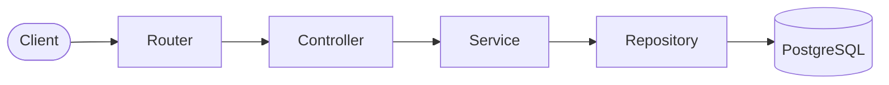

# StringHub API

A modern social networking API built with **Koa.js** and **TypeScript**, featuring JWT authentication, user profiles, posts, comments, likes, and image upload capabilities with Cloudinary integration.

---

## Requirements

- Node.js (LTS recommended)
- npm
- Docker & Docker Compose

---

## Quick Start

Get the project running in a few commands:

```bash
# Clone repository
git clone <repository-url>
cd snc-api

# Install dependencies
npm install

# Configure environment variables
cp .env.example .env
# Edit .env to match docker-compose.yml credentials

# Start database
docker-compose up

# Run migrations
npm run migrations

# (Optional) Seed database
npm run seeds

# Start the server
npm run dev
```

Your API will be available at `http://localhost:{PORT}/v1`.

---

## Tech Stack

- **TypeScript**
- **Koa.js**
- **Knex.js**
- **PostgreSQL**
- **Cloudinary**
- **Zod**
- **Jest**
- **Docker**

---

## Features

- JWT authentication and user management
- User profiles with avatar and cover image uploads
- Social networking functionality (posts, comments, likes)
- Image storage and processing with Cloudinary
- Type-safe API with TypeScript and Zod validation
- Comprehensive test coverage with Jest
- Database migrations and seeding

---

## Documentation

<details>
<summary><strong>Project Structure</strong></summary>

```
├─ /src
│  ├─ /common               # Shared utilities and error handling
│  │  ├─ /errors            # Custom error classes
│  │  ├─ /guards            # Type guards
│  │  └─ /response          # Response formatting
│  ├─ /config               # Configuration files
│  ├─ /controllers          # Request handlers for API endpoints
│  │  ├─ /auth              # Authentication controllers
│  │  ├─ /comments          # Comment management
│  │  ├─ /likes             # Like functionality
│  │  ├─ /posts             # Post management
│  │  └─ /users             # User and profile management
│  ├─ /middlewares          # Custom middleware functions
│  ├─ /repositories         # Data access layer
│  ├─ /routes               # Route definitions
│  │  ├─ /auth              # Authentication routes
│  │  ├─ /posts             # Post-related routes
│  │  └─ /users             # User-related routes
│  ├─ /schemas              # Zod validation schemas
│  │  ├─ /auth              # Authentication schemas
│  │  ├─ /comments          # Comment validation
│  │  ├─ /entities          # Entity schemas
│  │  └─ /posts             # Post validation
│  ├─ /services             # Business logic and utilities
│  ├─ /types                # TypeScript type definitions
│  └─ /utils                # Utility functions
├─ /config                  # External configuration
├─ /migrations              # Database migration scripts
├─ /seeds                   # Database seed scripts
├─ /tests                   # Test files and utilities
├─ .env.example             # Example environment variables
├─ docker-compose.yml       # Docker services configuration
├─ Dockerfile               # Application containerization
├─ Dockerfile.prod          # Production containerization
├─ knexfile.ts              # Knex configuration
├─ swagger.yml              # API documentation (OpenAPI)
└─ README.md
```

</details>

<details>
<summary><strong>Architecture & Database Schema</strong></summary>

### System Architecture



### Database Schema


</details>

---

## Scripts

- `npm run dev` – Starts the development server with hot reload using nodemon.
- `npm start` – Builds and starts the production server.
- `npm run build` – Compiles TypeScript to JavaScript in the `./dist` directory.
- `npm test` – Runs the test suite with Jest.
- `npm run lint` – Runs ESLint and auto-fixes TypeScript issues.
- `npm run prettier:check` – Checks code formatting with Prettier.
- `npm run prettier:format` – Formats code with Prettier.
- `npm run migrations` – Runs all database migrations.
- `npm run migrations:make` – Creates a new migration file.
- `npm run migrations:rollback` – Rolls back the last migration.
- `npm run seeds` – Runs all database seed files.
- `npm run seeds:make` – Creates a new seed file.

---

## Environment Configuration

Before running the application, environment variables must be configured:

1. Create a `.env` file in the project root.
2. Use `.env.example` as a reference.
3. Configure the variables with your data following the example:

```env
PORT=5000
SALT=10
JWT_SECRET=your-secret-key

# PostgreSQL Configuration
POSTGRES_USER=postgres
POSTGRES_PASSWORD=password
POSTGRES_HOST=localhost
POSTGRES_DB=snc_db
POSTGRES_DB_PORT=5432

# Cloudinary Configuration (for image uploads)
CLOUDINARY_URL=cloudinary://<api_key>:<api_secret>@<cloud_name>
```

---

## Database Setup

The project uses **PostgreSQL** running in Docker container.

1. Configure environment variables in `.env`.
2. Start the database container:
    ```bash
    docker-compose up
    ```
3. Run migrations:
    ```bash
    npm run migrations
    ```
4. (Optional) Seed initial data:
    ```bash
    npm run seeds
    ```

## Testing

Run the test suite:

```bash
# Run all tests
npm test

# Run tests in watch mode
npm run test:watch

# Run tests with coverage
npm run test:coverage
```

---

## CI/CD

This project uses GitHub Actions for continuous integration. The pipeline runs on pull requests to `main` and includes:

- Prettier formatting check
- Tests

---

## API Endpoints

Base URL: `/v1`

### Authentication

| Method | Endpoint            | Description                      | Access  |
| ------ | ------------------- | -------------------------------- | ------- |
| `POST` | `/v1/auth/register` | Register a new user              | Public  |
| `POST` | `/v1/auth/login`    | Authenticate user and return JWT | Public  |
| `GET`  | `/v1/auth/me`       | Get current authenticated user   | Private |

### Users

| Method   | Endpoint                   | Description                 | Access  |
| -------- | -------------------------- | --------------------------- | ------- |
| `GET`    | `/v1/users`                | Get all users               | Private |
| `GET`    | `/v1/users/:id/posts`      | Get posts by specific user  | Private |
| `GET`    | `/v1/users/profile`        | Get current user profile    | Private |
| `GET`    | `/v1/users/:id/profile`    | Get user profile by ID      | Private |
| `PATCH`  | `/v1/users/profile`        | Update current user profile | Private |
| `PUT`    | `/v1/users/profile/avatar` | Upload user avatar          | Private |
| `DELETE` | `/v1/users/profile/avatar` | Remove user avatar          | Private |
| `PUT`    | `/v1/users/profile/cover`  | Upload cover image          | Private |
| `DELETE` | `/v1/users/profile/cover`  | Remove cover image          | Private |

### Posts

| Method   | Endpoint                  | Description                 | Access         |
| -------- | ------------------------- | --------------------------- | -------------- |
| `GET`    | `/v1/posts`               | Get all posts               | Public/Private |
| `GET`    | `/v1/posts/with-comments` | Get all posts with comments | Public         |
| `GET`    | `/v1/posts/:id`           | Get specific post           | Private        |
| `POST`   | `/v1/posts`               | Create new post             | Private        |
| `PATCH`  | `/v1/posts/:id`           | Update post                 | Private        |
| `DELETE` | `/v1/posts/:id`           | Delete post                 | Private        |

### Comments

| Method   | Endpoint                            | Description                    | Access  |
| -------- | ----------------------------------- | ------------------------------ | ------- |
| `GET`    | `/v1/comments`                      | Get all comments               | Private |
| `GET`    | `/v1/posts/:id/comments`            | Get comments for specific post | Private |
| `POST`   | `/v1/posts/:id/comments`            | Create comment on post         | Private |
| `PATCH`  | `/v1/posts/:id/comments/:commentId` | Update comment                 | Private |
| `DELETE` | `/v1/posts/:id/comments/:commentId` | Delete comment                 | Private |

### Likes

| Method | Endpoint              | Description                 | Access  |
| ------ | --------------------- | --------------------------- | ------- |
| `POST` | `/v1/posts/:id/likes` | Toggle like on post         | Private |
| `GET`  | `/v1/posts/:id/likes` | Get likes for specific post | Private |

---
